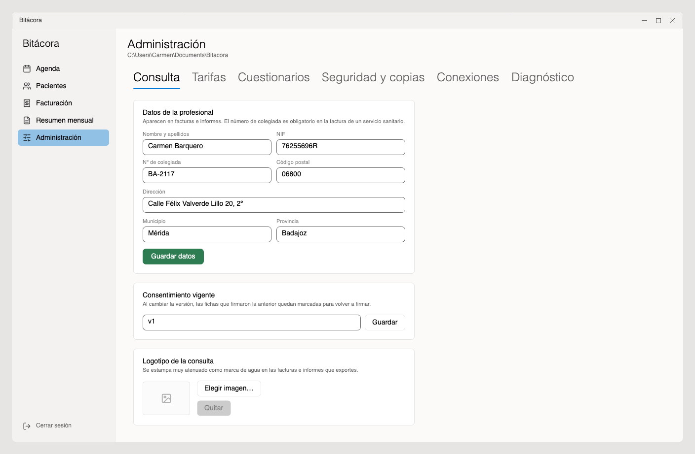
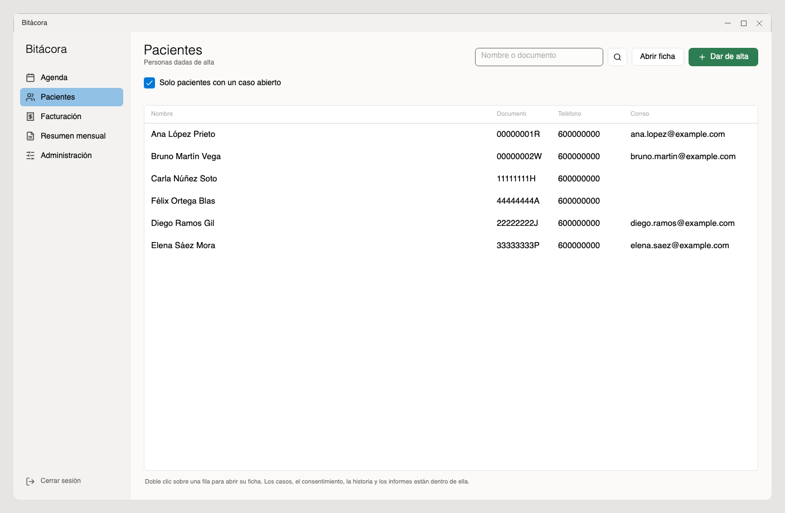
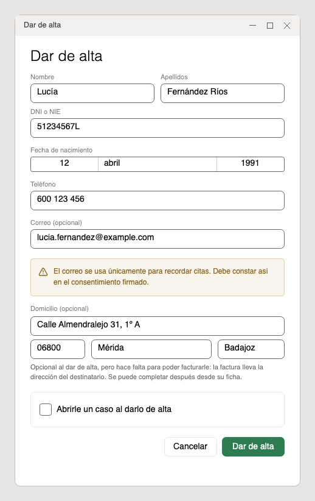
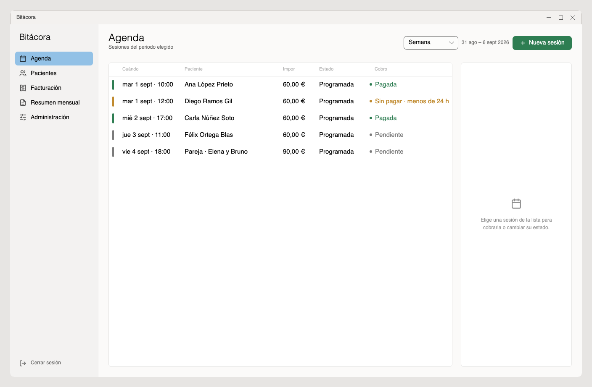
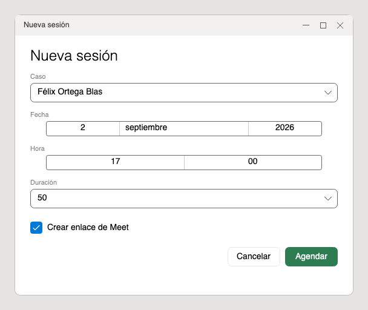
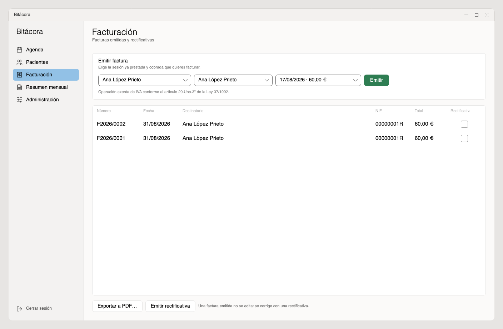
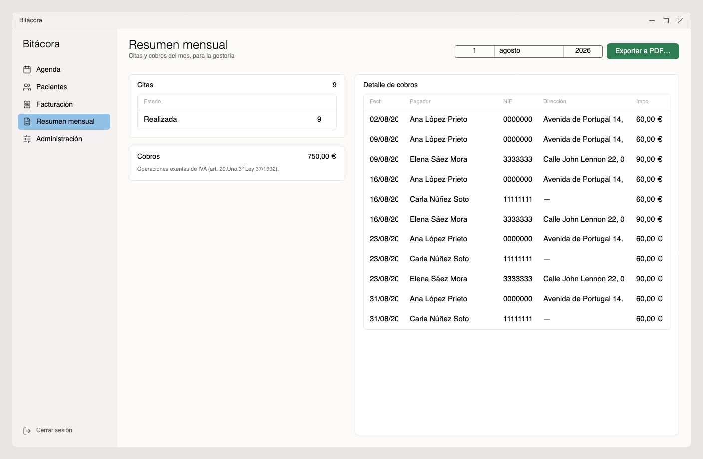

# Bitácora · guía de uso

Para Carmen. Va en el orden en que se hacen las cosas: primero instalar, luego
dejar la consulta configurada, y después el día a día.

No hace falta leerla entera de una vez. Las tres primeras secciones son de una
sola vez; a partir de «El día a día» está lo que se usa siempre.

---

## 1. Instalar

1. Descargar el instalador desde este enlace, que siempre apunta a la última
   versión:
   <https://github.com/emiliocastilo/bitacora-descargas/releases/latest/download/Bitacora-win-Setup.exe>
2. Ejecutarlo. Sale una ventanita de progreso y, al terminar, la aplicación se
   abre sola.

> Si el enlace no funcionara, abrir
> <https://github.com/emiliocastilo/bitacora-descargas/releases> y descargar
> **Bitacora-win-Setup.exe** de la versión de arriba. En esa lista hay más
> archivos (uno acabado en `.nupkg`, otro llamado `RELEASES`…); no hacen falta.

**Windows dirá que no reconoce el programa.** Aparece una pantalla azul,
«Windows protegió tu PC». Es lo normal en un programa sin firma de empresa, no
es un aviso de virus. Hay que pulsar **Más información** y luego **Ejecutar de
todas formas**.

No pregunta dónde instalar ni dónde guardar los datos: eso ya está decidido. El
programa se instala en la carpeta del usuario y los datos van a `Documentos\Bitacora`
(si Documentos estuviera sincronizado con OneDrive, van a una carpeta local del
equipo, para no corromper la base). La ruta exacta se ve luego en
**Administración**, debajo del título; conviene saberla para las copias en USB
(sección 7).

Después, la aplicación se actualiza sola. Cada vez que se abre comprueba si hay
versión nueva; cuando la hay, aparece un botón **Actualizar y reiniciar** al pie
de la barra de la izquierda, y al pulsarlo se reinicia ya actualizada.

---

## 2. Crear la consulta (solo la primera vez)

Al abrirla por primera vez sale **«Vamos a preparar la consulta»**.

1. Elegir un **nombre de usuario** y una **contraseña**. Mínimo doce
   caracteres.
2. Repetirla y pulsar **Crear la consulta**.
3. Aparece una última pantalla, **«Conectar con Google»**. Se puede hacer ahora
   —hace falta el archivo `client_secret.json`, explicado en §3.5— o pulsar
   **Ahora no** y dejarlo para más tarde. En los dos casos se entra a
   continuación en **Administración**.

**Sobre la contraseña, que esto importa de verdad.** Todo va cifrado con ella:
la base de datos y también las copias de seguridad. No se guarda en ninguna
parte, ni siquiera cifrada, así que **nadie puede recuperarla**: ni yo, ni
Google, ni reinstalando. Si se pierde la contraseña y no hay clave de
recuperación, los datos no se abren nunca más.

La clave de recuperación se genera en el paso siguiente y es el único seguro
que existe contra eso.

> Si ya hubiera una consulta en otro ordenador, aquí abajo están **Buscar en
> Drive…**, **Desde una carpeta…** y **Desde un archivo…**. Están explicados en
> la sección 7.

---

## 3. Dejar la consulta lista

Al entrar se aterriza en **Administración**, repartida en pestañas: *Consulta*,
*Tarifas*, *Cuestionarios*, *Seguridad y copias*, *Conexiones*, *Diagnóstico* y
*Tema*.

Para dejar la consulta lista hay que pasar por cuatro, y ya no se vuelven a
tocar salvo que cambie algo: **Consulta** (§3.1), **Tarifas** (§3.2), **Seguridad
y copias** (§3.3 y §3.4) y **Conexiones** (§3.5). *Cuestionarios* solo hace falta
si se van a pasar test (§6), *Diagnóstico* (§3.6) no se toca y *Tema* (§3.7) es
cuestión de gusto.

### 3.1 Consulta

Tres cosas en esta pestaña:

- **Datos de la profesional**: nombre y apellidos, NIF, número de colegiada,
  dirección. Salen en las facturas y en los informes. **El número de colegiada es
  obligatorio** en la factura de un servicio sanitario. Pulsar **Guardar datos**.
- **Consentimiento vigente**: una etiqueta con la versión del documento de
  consentimiento que se está haciendo firmar (por ejemplo `2026-01`). No es el
  documento en sí —el consentimiento firmado de cada paciente se guarda en su
  ficha (§4)—, solo sirve para saber quién firmó qué: al cambiar la versión, las
  fichas que habían firmado la anterior quedan marcadas para volver a firmar.
- **Logotipo de la consulta**: se estampa como marca de agua muy atenuada en las
  facturas e informes que se exporten. Opcional.

### 3.2 Tarifas

- **Tipos de terapia**: la lista de lo que ofrece la consulta. Vienen dos puestas,
  **Terapia individual** y **Terapia de pareja**, y se pueden añadir las que hagan
  falta con **Añadir**: se le pone nombre (por ejemplo, «Individual online») y se
  marca **De pareja** si necesita dos personas. Cada una lleva su propio precio,
  que es el que se aplica a las sesiones de los casos abiertos con esa terapia.
- **Retirar una terapia**: el interruptor de cada línea. Una terapia retirada deja
  de ofrecerse al abrir casos nuevos, pero **no se borra nada**: los casos que ya
  la usaban siguen igual y su historial de precios se conserva. Se puede volver a
  activar cuando se quiera.
- **Aviso para cancelar**: horas. Por debajo de ese margen, la sesión cancelada
  se cobra entera. Vienen 24 puestas.
- **Recordar al paciente**: horas antes de la sesión para enviarle el correo de
  recordatorio. Un 0 significa no enviar ninguno.
- **Plazo para recuperar una sesión**: días que se dan por defecto cuando el
  pago de una sesión cancelada se deja como crédito. El consentimiento anuncia
  un mes (30); se puede ampliar caso por caso, con un motivo.

Pulsar **Guardar tarifas**.

Cambiar una tarifa **solo afecta a lo que se agende a partir de ese momento**.
Las sesiones ya agendadas conservan el importe que tenían.

### 3.3 La clave de recuperación

En la pestaña **Seguridad y copias** hay cuatro apartados: el registro de accesos
y las copias de seguridad (los dos explicados en §7), la clave de recuperación y
la verificación en dos pasos. Los dos últimos se dejan puestos ahora.

Esto es lo más importante de toda la guía.

1. En **Administración › Seguridad y copias**, bajar hasta **Clave de recuperación**.
2. Escribir la contraseña en **Confirma tu contraseña**.
3. Pulsar el botón de generar.
4. Aparece un código de ocho grupos, tipo `4KWQ-9M2T-…`. Pulsar **Guardar en un
   archivo…**, imprimirlo, y **guardar el papel fuera del ordenador**: una
   carpeta física, una caja fuerte, en casa.
5. Pulsar **Ya la he guardado** para que desaparezca de pantalla.

Es lo único que permite entrar si se olvida la contraseña. No sirve de nada
guardarlo en el mismo ordenador, ni en el correo. Generar una clave nueva
invalida el papel anterior.

### 3.4 Verificación en dos pasos (opcional, recomendable)

Añade un segundo candado: además de la contraseña, un código de seis dígitos que
va cambiando y que sale de una app en el móvil (Google Authenticator, Aegis,
1Password, la que sea).

1. En la misma pestaña, bajar hasta **Verificación en dos pasos**.
2. Escribir la contraseña y pulsar **Activar…**.
3. Aparece un código QR. Abrir la app de verificación en el móvil, darle a añadir
   cuenta y escanearlo. Si no se puede escanear, teclear a mano el texto que sale
   debajo del QR.
4. La app empieza a mostrar un código de seis dígitos. Escribirlo en la casilla y
   pulsar **Activar**.

A partir de ahí, cada vez que se entre se pedirá la contraseña y después ese
código. Para desactivarlo hacen falta la contraseña y un código válido.

**Si se pierde el móvil.** Se entra con la clave de recuperación en papel (la de
§3.3, ahora sí): al hacerlo, la verificación en dos pasos se apaga y hay que
volver a configurarla con el móvil nuevo. Por eso el papel sigue siendo
imprescindible aunque se use el segundo factor.

**La hora tiene que estar bien.** El código depende del reloj: si el del ordenador
o el del móvil va desajustado más de medio minuto, el código se rechaza. Con la
hora automática activada en ambos no hay problema.

### 3.5 Conectar Google

Sirve para tres cosas: meter las sesiones en el calendario, crear los enlaces
de Meet, y subir las copias de seguridad a Drive.

Se conecta desde **Administración › Conexiones** (o en la pantalla del primer
arranque, §2) cargando el archivo de credenciales `client_secret.json`. Se abre
el navegador, se acepta con la cuenta de la consulta, y ya queda.

**Qué ve Google y qué no.** En el calendario solo aparece una etiqueta del tipo
`Sesión · AR-3f9c1b`: nunca el nombre del paciente ni el motivo. El paciente no
se añade como invitado del evento. Las copias que suben a Drive van cifradas:
Google recibe bytes que no puede leer.

### 3.6 Informes de diagnóstico

En **Administración › Diagnóstico** está el registro de fallos técnicos que la
aplicación recoge sola: una copia que no se pudo hacer, Google que no responde,
un error inesperado. En cada arranque se manda un informe con lo nuevo al
correo de quien mantiene la aplicación, **sin que haya que pulsar nada**.

El informe **no lleva datos de pacientes**: solo el tipo de fallo, la traza
técnica y datos del equipo (versión, sistema, espacio en disco). Desde esa
misma pestaña se puede **desactivar el envío automático** y marcar cada
incidencia como revisada. El registro no se borra.

### 3.7 Tema

En **Administración › Tema** se elige el aspecto de la aplicación: **Claro**,
**Oscuro** o **Automático**. Cambia en cuanto se pulsa —no hay que guardar ni
volver a entrar— y así se queda para los siguientes arranques.

**Automático** es lo que viene de fábrica: la aplicación sigue al sistema, de
modo que si Windows se pone oscuro al anochecer, Bitácora también.

El tema es de **este ordenador**, no de la consulta: no viaja con los datos ni
con las copias de seguridad, así que el portátil puede ir en oscuro y el
ordenador de la mesa en claro.

---

## 4. El día a día

Cinco secciones a la izquierda: **Agenda**, **Pacientes**, **Facturación**,
**Resumen mensual** y **Administración**.

### Dar de alta a un paciente

**Pacientes** → **Dar de alta**. Se abre una ventana: nombre, apellidos, DNI o
NIE, fecha de nacimiento, teléfono y correo (el correo es opcional, pero sin él
no se le pueden enviar avisos de cita).

Debajo va el **domicilio**, también opcional. Se puede dejar en blanco y
completarlo después desde la ficha, pero hace falta para poder facturarle: la
factura lleva la dirección del destinatario. Va todo junto —calle, código
postal, municipio y provincia—: media dirección no vale, y la ventana avisa si
se rellenan unos campos y otros no.

### Abrir un caso

Una persona dada de alta todavía no tiene terapia. Hay que abrirle un caso: en su
ficha se elige el **tipo de terapia** en la lista de arriba y se pulsa **Abrir
caso**. Si la terapia elegida es de pareja, pide a la otra persona, que tiene que
estar dada de alta antes.

También se puede abrir en el mismo momento del alta, marcando **Abrirle un caso al
darlo de alta**.

Las sesiones y los informes cuelgan del caso, no de la persona. Una misma
persona puede tener a la vez un caso individual y uno de pareja, y cada uno
lleva su historia y su facturación por separado.

### Cerrar un caso

Cuando la terapia termina, en la tarjeta del caso de la ficha se pulsa **Cerrar
caso** y se indica la fecha de cierre. Un caso cerrado no admite citas nuevas,
pero su historia, sus informes y sus facturas se conservan. Si hay que retomarlo,
**Reabrir** lo vuelve a activar.

Cerrar los casos hace falta, además, para poder **suprimir** la ficha más
adelante (§10): una ficha con casos abiertos no se puede suprimir.

### Registrar el consentimiento

En Pacientes, con la persona elegida: **Registrar consentimiento firmado…**, y
se adjunta el documento escaneado. Queda guardado cifrado dentro de la ficha.

Si el escaneo ya está a la vista en el Explorador, se puede **arrastrar el PDF**
sobre el recuadro de puntos que hay justo debajo de esos botones y soltarlo ahí:
hace lo mismo sin pasar por el diálogo de archivos. El recuadro se enciende
cuando lo que se lleva encima vale, y se pone en rojo cuando no (por ejemplo, un
Word en vez de un PDF, o varios archivos a la vez).

---

## 5. Agenda

### Los tres modos

La Agenda es un calendario y se mira de tres maneras, que se eligen en la
cabecera:

- **Día**: la jornada entera, hora a hora. Como la columna es ancha, cada sesión
  se lee de un vistazo sin tener que abrirla: hora de inicio y fin, duración,
  paciente, importe y cobro. Arriba de todo, cuántas sesiones hay, lo que suman y
  cuánto queda por cobrar ese día.
- **Semana**: una columna por día. Es el modo de trabajo y con el que se entra.
- **Mes**: las semanas completas, con las sesiones escritas dentro de cada
  casilla. Es para encuadrar el mes, no para cobrar; por eso aquí no sale el
  panel de la derecha y sí un pie con las sesiones del mes, lo previsto, lo
  cobrado y lo que sigue sin cobrar.

Las flechas **‹** y **›** mueven un día, una semana o un mes, según el modo en
el que se esté. **Hoy** vuelve al presente.

En Día y en Semana una línea fina cruza la jornada de hoy por la hora que es, y
la franja que se dibuja va de las 8 a las 20 salvo que haya sesiones fuera de
ella: entonces se estira lo que haga falta, porque una rejilla más alta se baja
con la barra y una sesión escondida no se ve nunca.

**Fin de semana** añade el sábado y el domingo. Viene apagado porque la consulta
no suele pasar sesión esos días y, sin esas dos columnas, las cinco de diario
son bastante más anchas. Si hay una sesión en sábado o en domingo, su columna
sale igual aunque el interruptor esté apagado: una preferencia de ancho no puede
esconder una cita.

### Del mes al día

En **Mes**, cada fila lleva a la izquierda una franja estrecha con el número de
la semana. Al pulsarla, esa semana se abre en modo Semana. Y al pulsar una
casilla se abre ese día. Es el camino natural de trabajo: el mes enseña dónde
está la carga y desde ahí se entra a trabajarla, sin volver a **Hoy** y contar
flechas.

### Agendar una sesión

En **Agenda**, el botón **+ Nueva sesión** abre una ventana: elegir el caso, la
fecha, la hora y la duración. El importe no se pide aquí: sale de la tarifa del
tipo de terapia del caso.

Para online, **Crear enlace de Meet** lo genera automáticamente al agendar. Si se
prefiere otro (Zoom, el que sea), se desmarca esa casilla y se pega el enlace en
el campo que aparece debajo.

Pulsar **Agendar**.

Hay un atajo que ahorra teclear la fecha: en **Día** y en **Semana**, al pasar
el ratón por un rato libre aparece **+ Agendar a las …**. Al pulsarlo se abre la
misma ventana con ese día y esa hora ya puestos. Los ratos libres se ofrecen de
media hora en media hora, para que encajen también las sesiones de 30 y de 45
minutos.

### Avisar al paciente

Justo después de agendar sale una ventana **Enviar la cita** con el correo ya
redactado: destinatario, asunto y mensaje, todo modificable. **Enviar al
paciente** lo manda; **Ahora no** lo deja sin enviar. La sesión queda agendada
en los dos casos: esa ventana solo decide si se avisa.

La misma ventana sale al **reprogramar** una sesión, con los datos de la cita
nueva y el texto adaptado para que se entienda que es un cambio de hora, no una
cita más.

Si el paciente no tiene correo en la ficha, se puede escribir ahí mismo.

**Por WhatsApp**: clic derecho sobre la sesión en el calendario, **Copiar cita
para WhatsApp**. Copia el mismo texto del correo al portapapeles, listo para pegarlo
en la conversación. No envía nada: solo copia.

**El recordatorio automático** (§3.2) se manda al abrir Bitácora, no por su
cuenta con el ordenador apagado: si un día no se abre el programa, ese día no se
avisa a nadie. Es a propósito, porque un envío que falla sin que nadie lo vea es
peor que no enviarlo. Cada sesión se recuerda una sola vez, así que abrir y
cerrar el programa varias veces no repite el correo.

### Los colores del cobro

Cada sesión lleva su color de cobro en el filete de la izquierda del bloque, y
el texto que dice lo mismo sale en el panel de la derecha al elegirla (en **Mes**,
en la leyenda del pie). El color va siempre acompañado de su texto: impreso en
blanco y negro, o visto con daltonismo, no distingue una sesión impagada de una
que se abona por haberse cancelado tarde.

Las sesiones que no llegaron a darse —canceladas o con ausencia— salen además
tachadas: el color dice cuánto se cobra, y el tachado dice si ocurrió, que son
dos preguntas distintas.

- **Verde** · «Pagada»: cobrada. Ya se puede facturar. Al elegir la sesión,
  debajo pone por dónde entró el dinero: «Cobrada por bizum», por ejemplo.
- **Neutro** · «Pendiente»: sin pagar, pero todavía queda margen antes de la
  sesión.
- **Ámbar** · «Sin pagar · menos de 24 h»: sin pagar y ya dentro de las horas de
  aviso. Es la que hay que mirar.
- **Rojo** · «Impagada»: la sesión ya ha empezado y sigue sin cobrarse.
- **Rojo** · «Se abona íntegra»: cancelada fuera de plazo, o ausencia sin avisar.
  Se cobra aunque no se haya dado.
- **Azul** · «Sin cargo · crédito»: cancelada sin cargo, pero ya estaba pagada:
  el importe queda como crédito para una sesión de recuperación.
- **Gris** · «Sin cargo»: cancelada en plazo. No hay nada que cobrar.

### Cerrar una sesión

Al pulsar una sesión del calendario se llena el panel de la derecha:

- **Pagada**, que cobra por Bizum sin preguntar, que es como entra casi todo. El
  botón lleva pegada una flechita a la derecha: al pulsarla salen **Pagada por
  Bizum** y **Pagada por transferencia**, para el cobro que no vino por Bizum. La
  forma de pago queda guardada y es la que luego sale impresa en la factura. (Y
  **Anular el pago** si se marcó por error.)
- **Realizada**: la sesión se dio.
- **No asistió**: no vino y no avisó. Se cobra.
- **Reprogramar**: mueve la sesión a otra fecha conservando el importe y el
  pago. Es lo que se usa cuando el paciente no puede venir pero se le va a dar
  la sesión igualmente. Al confirmar el cambio sale la misma ventana de aviso
  que al agendar, esta vez con la fecha nueva y diciendo que la cita se ha
  movido; **Ahora no** la deja sin enviar y la sesión queda movida igualmente.
- **Cancelar sesión**: la cancelación normal. No hay que echar cuentas: el
  programa mira la hora y decide solo. Si el aviso ha llegado con el margen
  pactado por delante, la sesión queda sin cargo; si ha llegado por debajo de
  ese margen, se abona entera.
- **Cancelar sin cargo**: fuerza mayor. No se cobra aunque el aviso llegue
  tarde. Es la excepción que recoge el consentimiento, y la decisión de aplicarla
  es tuya.

Si al dar una sesión por **realizada** ya estaba pagada, sale una ventana
**Emitir factura** que ofrece facturarla ahí mismo, sin pasar por Facturación. Si
el caso es de pareja se elige a quién se le factura; si no, basta con confirmar.
**Ahora no** la deja sin facturar: se puede emitir después desde Facturación (§8).

### Una sesión pagada que se cancela

Si la sesión ya estaba pagada, en vez de «Cancelar sin cargo» aparecen dos
opciones, porque hay que decidir qué pasa con el dinero:

- **Cancelar · dejar crédito para recuperar**: el importe queda como crédito
  para una sesión de recuperación de ese mismo caso. Se pone una fecha límite
  (por defecto, la que diga Administración; ampliarla más allá pide un motivo,
  que queda registrado). La decisión de perdonar un aviso tardío es tuya: aquí
  no se miran las 24 h.
- **Cancelar · devolver el importe**: no queda ni cobro ni crédito. El
  reintegro se hace por fuera.

Cuando el crédito existe, la sesión que lo generó muestra **Ampliar plazo del
crédito** en el panel.

### Recuperar la sesión

Al agendar una **Nueva sesión** de un caso con créditos disponibles aparece
**Cubrir con crédito**. Si se elige uno, la sesión queda pagada sin cobrar de
nuevo y se factura con normalidad cuando se dé por realizada. Si el importe del
crédito no coincide con el de la sesión, la diferencia se ajusta aparte.

---

## 6. Ficha, historia clínica, informes y material de trabajo

Desde **Pacientes** → **Abrir ficha**.

La ficha reúne los datos de la persona, sus casos abiertos, si tiene el
consentimiento firmado, sus informes y el material de trabajo que se le
haya pasado.

### Corregir los datos de un paciente

En la pestaña **Resumen** de la ficha, la tarjeta **Datos** tiene un botón
**Editar**. Ahí se corrigen nombre, apellidos, DNI o NIE, fecha de nacimiento,
teléfono y correo: un número que cambia, un apellido que faltaba, o el documento
que se tecleó mal el primer día. **Descartar** deja la ficha como estaba.

El **domicilio** se corrige aparte, con su propio **Editar** justo debajo, porque
va todo o nada (calle, código postal, municipio y provincia).

Se comprueba lo mismo que al dar de alta: el DNI o NIE tiene que ser válido y no
puede ser el de otra ficha, el correo tiene que estar bien escrito y la fecha de
nacimiento no puede quedar en el futuro. Si algo no cuadra, se dice y el
formulario se queda abierto con lo tecleado.

Cada corrección queda anotada en el **registro de accesos**, y la anotación dice
qué campos cambiaron. Eso es lo que acredita haber atendido una **rectificación**
si el paciente la pide.

Dos avisos:

- Si se cambia el nombre o los apellidos, cambia también el **seudónimo** con el
  que la persona aparece en Google Calendar (§3.5). Las citas ya creadas conservan
  el anterior.
- Una ficha **suprimida** no se corrige: hay que restaurarla antes.

### La historia clínica

Vienen ya puestas las diez secciones de la plantilla, para rellenar debajo de
cada una. Se escribe como en cualquier procesador de texto: se selecciona un
trozo y se le da formato con los botones de la barra de arriba —**Título**,
**Subtítulo**, negrita, cursiva, **Viñeta** y **Cita**—. El botón **Ver cómo
queda** enseña el resultado tal cual saldrá al guardarlo y al exportarlo.

**A tener presente** es un campo aparte, arriba. Lo que se escriba ahí se ve
nada más abrir la ficha: es para riesgo, o para cualquier cosa que no deba
pasarse por alto. Nunca se rellena solo a partir del texto de la historia.

**Guardar historia** para grabar.

### Informes

En la ficha: elegir el caso, escribir un título y **Crear informe**. Se redacta
igual, con la barra de formato y su vista previa. **Exportar a PDF…** lo saca con
el logotipo de marca de agua, si se subió uno en Administración.

### Material de trabajo

Pestaña **Material de trabajo** de la ficha. Cuelga del caso elegido arriba, igual
que los informes.

Para registrar algo: nombre (por ejemplo *WAIS-IV* o *BDI-II*), fecha en
que se pasó, notas o interpretación si se quiere, y el archivo. El archivo se
puede **arrastrar** sobre el recuadro de puntos o buscarlo con **…o elegir
archivo y guardar**; por los dos caminos se guarda con el nombre, la fecha y las
notas que estén escritos arriba. El archivo (PDF, o una foto/escaneo en JPG o
PNG) se guarda cifrado dentro de la ficha; en disco no queda nada legible.

Con un material elegido de la lista:

- **Previsualizar** — abre el archivo en una ventana aparte: las imágenes tal
  cual y los PDF como una imagen por página. El documento se descifra en memoria,
  no se escribe en el disco.
- **Guardar copia…** — descifra el archivo y lo deja donde se diga, para
  adjuntarlo a un informe o abrirlo con otro programa.
- **Eliminar** — borra el material y su archivo. Queda anotado en el registro de
  accesos, como cualquier otro movimiento sobre la historia clínica.

El material de trabajo entra también en el expediente que se le entrega al
paciente si ejerce su derecho de acceso.

### Cuestionarios

Pestaña **Cuestionarios** de la ficha. También cuelgan del caso elegido arriba.

Un cuestionario es una lista de preguntas con opciones y una forma de puntuarlas
(sumar, invertir los ítems de control, clasificar por tramos). Se preparan una vez
en **Administración → Cuestionarios**, importándolos desde un archivo JSON —lo
normal es pedirle a una IA que lo genere siguiendo `docs/cuestionarios.md`— y
**publicándolos**. Solo los publicados aparecen aquí.

Para pasar uno: elegir el cuestionario en el desplegable, **Cumplimentar…**,
marcar cada respuesta y **Guardar**. La aplicación suma y enseña la puntuación y
el tramo al momento. Si quedan respuestas sin marcar y el cuestionario no lo
permite, se guarda como *incompleto*.

Con un cuestionario elegido de la lista: **Ver respuestas** lo reabre en solo
lectura, se pueden editar las **notas**, y **Eliminar** lo borra (queda anotado en
el registro de accesos). También entran en el expediente del derecho de acceso.

Bitácora no interpreta clínicamente: solo cuenta y clasifica según lo que diga
cada plantilla.

---

## 7. Copias de seguridad y recuperación

### Cómo funcionan

Se hace una copia **al cerrar la aplicación, una vez al día**. Va cifrada con la
misma contraseña, y si Google está conectado sube sola a Drive, a la carpeta
«Bitácora · copias de seguridad».

La copia diaria (`bitacora-….zip`) solo lleva la base de datos: es pequeña y se
conservan los últimos días. Los documentos adjuntos (consentimientos, informes,
material de trabajo) se guardan **aparte, un solo ejemplar de cada uno**, en la carpeta
`copias/adjuntos` de al lado —y en su equivalente en Drive—. Así la copia de
cada día no vuelve a arrastrar los mismos documentos.

En Administración se puede forzar una con **Hacer una copia ahora**, ver las que
hay en Drive, y decidir cuántos días se conservan.

> Para llevarse una copia en un USB hay que copiar la carpeta `copias` **entera**
> (el `.zip` y la carpeta `adjuntos`), no solo el archivo. Está dentro de la
> carpeta de datos —normalmente `Documentos\Bitacora\copias`—; la ruta exacta
> aparece en **Administración**, debajo del título.

### Recuperar en un ordenador nuevo

Al abrir Bitácora por primera vez, en vez de crear la consulta:

- **Buscar en Drive…** — pide el archivo de credenciales de Google, abre el
  navegador, lista las copias que haya en Drive y se elige una. Trae también los
  documentos adjuntos.
- **Desde una carpeta…** — se apunta a la carpeta `copias` copiada entera (la del
  USB). Reconstruye la base y los documentos.
- **Desde un archivo…** — si solo se tiene el `.zip`. Recupera la consulta, pero
  sin los documentos adjuntos; avisa de cuántos faltan y se pueden traer luego de
  Drive.

Después pide la contraseña de siempre, y todo vuelve: pacientes, historias,
facturas, y también **la conexión con Google**, que viaja dentro de la copia.

### Si se olvida la contraseña

En la pantalla de entrada, **He olvidado la contraseña**. Pide el usuario, el
código de recuperación que se imprimió, y una contraseña nueva. El código se
puede escribir con guiones o sin ellos, y da igual mayúsculas o minúsculas.

Sin ese código no hay ninguna otra vía. No existe un «te enviamos un correo»:
si lo hubiera, quien entrara en el correo entraría en las historias clínicas.

Si estaba activada la verificación en dos pasos, al recuperar el acceso así se
apaga: hay que volver a configurarla (§3.4).

---

## 8. Facturación

**Facturación** → elegir el caso, a quién se factura y **la sesión concreta**
→ **Emitir**.

**Cada factura es de una sola sesión.** El desplegable de sesión solo ofrece
las que están **ya dadas y ya cobradas** y que no se hubieran facturado antes;
si un caso tiene varias sesiones pendientes, hay que emitir una factura por
cada una. Una sesión sin cobrar no aparece en la lista.

La factura sale **exenta de IVA** por el artículo 20.Uno.3º de la Ley del IVA,
que es lo que corresponde a la asistencia sanitaria.

**El concepto es siempre «Terapia de psicología».** No dice la modalidad (individual o
de pareja): esa factura puede acabar en manos de terceros y el tipo de terapia
es un dato de salud. Solo cuando se cobra una sesión a la que el paciente no
asistió, o una cancelación fuera de plazo, se añade «(sesión no realizada)» para
que se entienda el cargo.

**La factura sale en el impreso de siempre**: arriba, los datos de la consulta y
el número y la fecha; debajo, los del paciente por casillas (nombre, dirección,
población, código postal y provincia, que se toman de su domicilio en la ficha);
en medio, el concepto y el importe; y abajo el cuadro de IVA —al 0 %, por la
exención—, la forma de pago y el total. Si el paciente no tiene domicilio en la
ficha, esas casillas salen con un guion: conviene rellenarlo antes de emitir.

**Una factura emitida no se edita.** Si hay un error, se corrige con **Emitir
rectificativa**, que es lo que exige la normativa. **Exportar a PDF…** la saca
para enviarla.

---

## 9. El resumen para la gestoría

**Resumen mensual** → elegir el mes (el selector va por mes y año, sin día). Sale
lo que suele pedir la gestoría cada mes:
cuántas sesiones hubo por estado (realizadas, no asistió, canceladas…), el total
cobrado, y el detalle de cada cobro.

**Va por lo cobrado, no por lo facturado.** Si una sesión de agosto se cobró en
agosto pero no se factura hasta septiembre, cuenta en el resumen de agosto — el
mes en que entró el dinero, no el mes de la factura. No hace falta tener las
facturas al día para sacar el resumen.

El detalle de cada cobro lleva la fecha, el nombre, el NIF y la dirección de
quien paga, y el importe: los mismos datos que llevaría la factura, aunque esa
sesión todavía no se haya facturado. Es lo que la gestoría necesita para
declarar el ingreso.

**Créditos de sesión.** Si en el mes hubo créditos (sesiones pagadas que se
cancelaron sin cargo y se recuperan más tarde), sale un bloque con cuántos se
generaron, cuántos se consumieron y cuántos quedan pendientes. Sirve para que la
gestoría entienda un cobro que ese mes no cuadra con ninguna sesión ni factura:
el dinero entró, la sesión llega después. El importe del crédito solo cuenta una
vez, el mes en que se pagó.

**No aparece el tipo de terapia.** Ni en el recuento de citas ni en el detalle de
cobros: el documento va a un tercero (la gestoría) y cruzar a una persona con una
modalidad de terapia sería darle un dato de salud que no necesita para su trabajo.

**Exportar facturas del mes…** empaqueta en un ZIP todas las facturas emitidas
ese mes, cada una en su propio PDF, para adjuntarlas al resumen que se manda a la
gestoría. Si el mes no tiene ninguna factura emitida, avisa en vez de dar un ZIP
vacío.

**Exportar a PDF…** lo saca ya con los datos fiscales y el logotipo, listo para
enviarlo.

---

## 10. Cosas que conviene saber

**No mover la carpeta de datos a Drive, OneDrive ni Dropbox.** La aplicación lo
impide a propósito: la sincronización continua corrompe la base de datos. A la
nube van las copias, que para eso están.

**El registro de accesos** (Administración → Ver el registro…) deja constancia
de cada consulta y cada cambio en una historia clínica. Es una obligación legal
y solo se puede mirar, no borrar.

**Suprimir una ficha** no la borra: deja de tratarse y se borran teléfono y
correo de inmediato, pero los datos se conservan **cinco años**, que es el
mínimo que exige la Ley 41/2002. Ese plazo se cuenta desde el **cierre del
último caso** de la persona (por eso hay que cerrarlos antes de suprimir), no
desde el día de la supresión. Pasado el plazo, **Destruir las caducadas** en
Administración las elimina de verdad.

**Bloqueo por intentos.** Cinco contraseñas fallidas seguidas bloquean el
acceso un rato. Es a propósito. Los códigos de verificación fallidos cuentan
igual.
